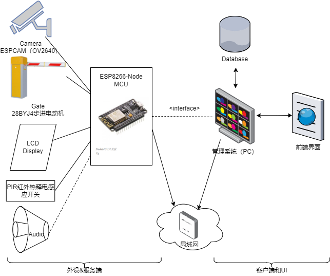

## 系统结构图

## interface说明

MCU到PC的接口（待议）

- SOCKET_CONNECT
- SOCKET_DISCONNECT
- GATE_ON
- GATE_OFF
- VIDEO_STREAM
- AUDIO_PLAY
- LED_DIAPLAY

## 系统结构图整体简述

硬件部分拟选用ESP8266-Node微控制器；ESPCAM（OV2640）摄像头模组（Camera），28BYJ4步进电动机带ULN2003驱动板作为闸机模块（Gate），12864液晶显示作为车牌和余额显示模块（LCD Display），以及PIR红外热释电感应开关探头等组成系统外设。

微控制器作为嵌入式控制系统服务端，集中管理和控制所有外设、中断，并通过WIFI连接局域网维护（可能的）和外设的连接，以及与PC的通信，包括支持接口（interface）定义的控制和功能调用，以及传输摄像头拍摄的视频流或照片。

PC端作为客户端，与服务端应处于同局域网内，维护一个前端界面（可以是浏览器）、数据库，以实现相应的功能。

